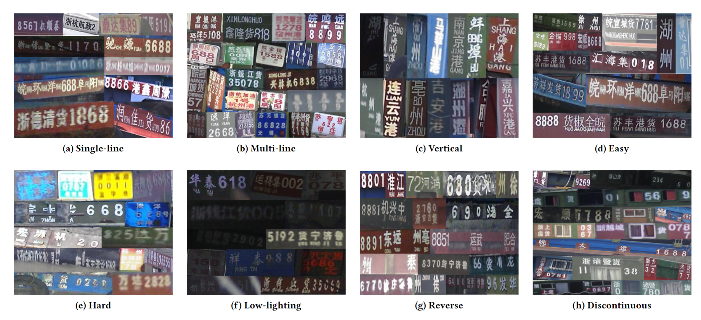
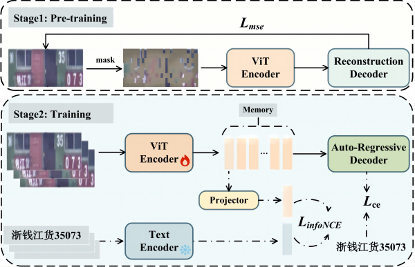

# Towards Ship License Plate Recognition in the Wild: A Large Benchmark and Strong Baseline




In this work, we first built a large dataset called SLP34K. The dataset was collected based on a real-world waterway intelligent traffic surveillance system. Images in the datasets were captured by eight surveillance cameras located at eight different locations over 42 months. Finally, by using more cameras located at more different locations and long-period capturing, we have obtained a dataset of 34,385 SLP images of high diversity.




We also propose a simple yet effective SLP recognition baseline method, with a strong visual encoder. The strong visual encoder is achieved by two strategies. First, we employ self-supervised learning, to pre-train the visual encoder, which enables the encoder to learn robust visual representations without labeled data. Second, we refine the encoder via a semantic enhancement module, which finetunes the encoder via a contrastive learning mechanism to enhance the semantic consistency between the SLP image and its corresponding text label.

# Table of Contents

- [Towards Ship License Plate Recognition in the Wild: A Large Benchmark and Strong Baseline](#towards-ship-license-plate-recognition-in-the-wild-a-large-benchmark-and-strong-baseline)
- [Table of Contents](#table-of-contents)
- [1. Runtime environment](#1-runtime-environment)
  - [1.1 Anonymous code acquisition](#11-anonymous-code-acquisition)
  - [1.2 Self-supervised pre-training environment](#12-self-supervised-pre-training-environment)
  - [1.3 SLP recognition fine-tuning environment](#13-slp-recognition-fine-tuning-environment)
- [2. Dataset and pre-trained models download](#2-dataset-and-pre-trained-models-download)
  - [2.1 Dataset download](#21-dataset-download)
  - [2.2 Pre-trained models download](#22-pre-trained-models-download)
- [3. Model training](#3-model-training)
  - [3.1 Pre-training](#31-pre-training)
    - [Pre-training on SLP34K](#pre-training-on-slp34k)
    - [Pre-training on Union14M](#pre-training-on-union14m)
  - [3.2 SLP/Text recognition fine-tuning](#32-slptext-recognition-fine-tuning)
    - [Training on SLP34K (for SLP recognition)](#training-on-slp34k-for-slp-recognition)
    - [Training on Union14M (for text recognition)](#training-on-union14m-for-text-recognition)
  - [3.3 Evaluation](#33-evaluation)
    - [Evaluation on SLP34K](#evaluation-on-slp34k)
    - [Evaluation on Union14M](#evaluation-on-union14m)
    - [Evaluation on six common benchmarks](#evaluation-on-six-common-benchmarks)
- [4. Local online testing with Gradio](#4-local-online-testing-with-gradio)


# 1. Runtime environment

   

## 1.1 Anonymous code acquisition

```shell
git clone https://github.com/kynehc/clone_anonymous_github.git
cd clone_anonymous_github
python download.py --url https://anonymous.4open.science/r/1109-0B02/ --dir slp34k_rec/

```
We use Anaconda as a virtual environment setup tool for model training. Next, we will introduce the training environment setup steps for self-supervised pretraining and SLP recognition fine-tuning, as well as the required installation configuration files. Due to conflicts between certain software package versions, our pre-training and fine-tuning were completed in two different virtual environments.

## 1.2 Self-supervised pre-training environment
```shell

cd slp34k_rec/mae
conda create -n slk34k_mae python=3.8
conda activate slk34k_mae
pip install torch==1.8.1+cu111 torchvision==0.9.1+cu111 -f https://download.pytorch.org/whl/torch_stable.html
pip install -r requirements.txt
```

- **Attention please**: Please note that our pre-training code requires the installation of timm software version 0.3.2 (timm==0.3.2). Therefore, if your PyTorch version is higher than 1.8.1, you may need to make some corresponding code modifications. For more details, please refer to this [issue](https://github.com/huggingface/pytorch-image-models/issues/420#issuecomment-776459842).

## 1.3 SLP recognition fine-tuning environment

```shell
cd slp34k_rec/ocr_training
conda create --name slk34k_rec python=3.9
conda activate slk34k_rec
pip install -r requirements.txt
pip install torch==1.12.1+cu116 torchvision==0.13.1+cu116 torchaudio==0.12.1 --extra-index-url https://download.pytorch.org/whl/cu116
```

# 2. Dataset and pre-trained models download

## 2.1 Dataset download

| Dataset   | File Size | Format      | Download link.                                                                                        |
| --------- | --------- | ---------- | ----------------------------------------------------------------------------------------------------- |
| SLP34K.7z | 153.8 MB  | JPG | [Google Drive](https://drive.google.com/file/d/1Wcui9wxRM_-Qj7zOmWNx43DnbNZRq0jP/view?usp=drive_link) |
| data.7z   | 6.36 GB   | lmdb       | [Google Drive](https://drive.google.com/file/d/1tGtpSXzuU1CYq-Sofo1rAD4jr4XLiOkO/view?usp=drive_link) |

SLP34K.7z is the raw image of the SLP sample, and data.7z is the corresponding sample in lmdb format.

Download the **data.7z** file, extract it, and place it in the **ocr_training/data**. The directory structure of the dataset is as follows.
```text
|--data
  |--test
    |--SixCommon_benchmark
      |--CUTE80
      |--IC13_1015
      |--IC13_2077
      |--III5K
      |--SVT
      |--SVTP
    |--SLP34K_lmdb_train
      |--IV_lmdb
      |--low_lmdb
      |--multi-lines_lmdb
      |--normal_lmdb
      |--OOV_lmdb
      |--single-line_lmdb  
      |--vertical_lmdb
    |--Union14m_benchmark
      |--artistic
      |--...
  |--train
    |--SLP34K_lmdb_train
    |--Union14m-L
      |--...
  |--val
    |--SLP34K_lmdb_test
    |--Union14m_benchmark
      |--..

```

## 2.2 Pre-trained models download


| CheckPoint        | File Size | Usage                         | Google Drive                                                                                          |
| ----------------- | --------- | ----------------------------- | ----------------------------------------------------------------------------------------------------- |
| pretrain_model.7z | 2.2GB     | Pre-trained weights         | [Google Drive](https://drive.google.com/file/d/1K6jmsRNvnKL5om352MJ7CU3K0xA7EjtN/view?usp=drive_link) |
| checkpoint.7z     | 2.7GB     | SLP recognition | [Google Drive](https://drive.google.com/file/d/1s1VHmofcvZic0WkVxfx1PHv2F5MOS-VH/view?usp=drive_link) |


Download the weights above, unzip them, and place them in the **ocr_training/** directory. 

# 3. Model training

Our baseline method was trained and evaluated on both the SLP34K dataset and the publicly available text recognition dataset Union14M. Next, we will describe how the model was trained and tested on these two datasets.

## 3.1 Pre-training

### Pre-training on SLP34K

Please make sure that data.7z has been successfully extracted.

```shell
cd ./mae

mkdir pretrain_data

cp -r ../ocr_training/data/train/SLP34K_lmdb_train  ./pretrain_data


CUDA_VISIBLE_DEVICES=0,1 python3 -m torch.distributed.launch --nproc_per_node=2 main_pretrain.py --data_path pretrain_data/SLP34K_lmdb_train  --mask_ratio 0.75 --model mae_vit_base_patch16_224x224  --output_dir  pretrain_SLP34K_patch16_224x224  --log_dir  pretrain_SLP34K_patch16_224x224 --batch_size 128 --norm_pix_loss --epochs 1500 --warmup_epochs 40 --blr 1.5e-4 --weight_decay 0.05

```

### Pre-training on Union14M
```shell
cd ./mae

CUDA_VISIBLE_DEVICES=1,2 python3 -m torch.distributed.launch --nproc_per_node=2  \
main_pretrain.py --data_path pretrain_data/Union14M-U/boo32_lmdb \ 
pretrain_data/Union14M-U/cc_lmdb/  pretrain_data/Union14M-U/openvino_lmdb/ \
--mask_ratio 0.75 --model mae_vit_base_patch4_32x128 --output_dir  pretrain_Union14M_patch4_32x128 \
--log_dir  pretrain_Union14M_patch4_32x128 --batch_size 50 --norm_pix_loss --epochs 20 \
--warmup_epochs 40 --blr 1.5e-4 --weight_decay 0.05

```


## 3.2 SLP/Text recognition fine-tuning

After the completion of the first stage of pre-training, we enter the second stage of fine-tuning training for SLP recognition. Please follow the codes below to complete the fine-tuning training.

### Training on SLP34K (for SLP recognition)

```shell
cd ./ocr_training

HYDRA_FULL_ERROR=1 CUDA_VISIBLE_DEVICES=0,1  python train.py model.img_size=[224,224] \
charset=SLP34K_568  dataset=SLP34K model.batch_size=60  trainer.gpus=2 \ 
trainer.val_check_interval=200  model=maevit_infonce_plm trainer.max_epochs=100 \ 
hydra.run.dir=outputs/ship/maevit_infonce_plm model.max_label_length=50  \
+trainer.accumulate_grad_batches=5  model.mae_pretrained_path=./pretrain_model/ship/224x224_pretrain_ship_vit_checkpoint-1499.pth

```

### Training on Union14M (for text recognition)
```shell
cd ./ocr_training

HYDRA_FULL_ERROR=1 CUDA_VISIBLE_DEVICES=0,1  python train.py model.img_size=[32,128] \
charset=union14m  dataset=union14m model.batch_size=90  trainer.gpus=2 \
trainer.val_check_interval=200  model=maevit_infonce_plm trainer.max_epochs=10 \ 
hydra.run.dir=outputs/union14m/maevit_infonce_plm model.max_label_length=25 \
+trainer.accumulate_grad_batches=5 model.mae_pretrained_path=./pretrain_model/union14m/32x128_pretrain_union14m_vit_checkpoint_20.pth


```


## 3.3 Evaluation

After the model training is completed, we can proceed with the performance evaluation of the model. Next, we will provide test scripts for evaluating the performance on different datasets.

### Evaluation on SLP34K

```shell
cd ./ocr_training

./test.py outputs/ship/maevit_infonce_plm/checkpoints/last.ckpt --batch_size 700
--test_data SLP34K --test_dir SLP34K_lmdb_benchmark


```

### Evaluation on Union14M

```shell
cd ./ocr_training

./test.py outputs/union14m/maevit_infonce_plm/checkpoints/last.ckpt --batch_size 700 \
--test_data TEST_UNION14M --test_dir Union14m_benchmark

```


### Evaluation on six common benchmarks

```shell
cd ./ocr_training

./test.py checkpoint/Union14M_maevit_infonce_plm_SOTA/checkpoints/last.ckpt --batch_size 700 \
--test_data TEST_BENCHMARK --test_dir SixCommon_benchmark

```

# 4. Local online testing with Gradio

We provide a local SLP recognition performance testing script based on Gradio. With the dataset we provide and the model provided by us or trained by yourself, you can test the SLP recognition performance locally.
```shell
cd ./ocr_training

python gradio_SLP34K.py

```
